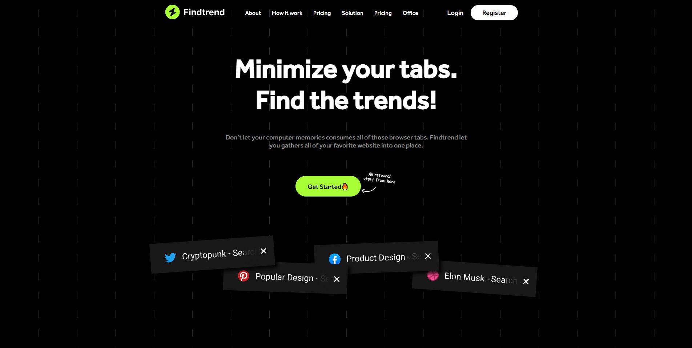
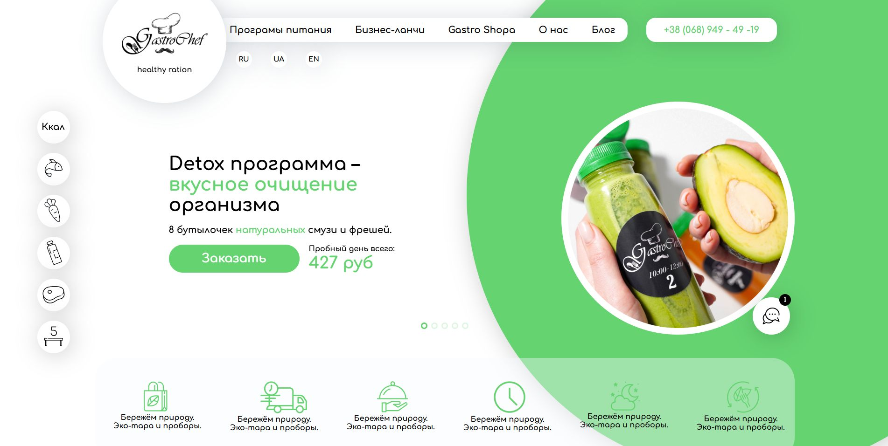
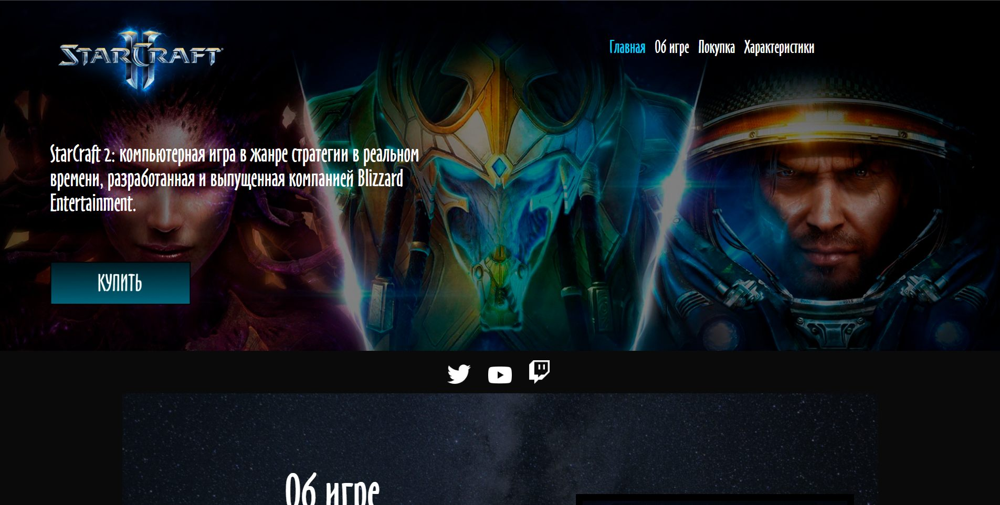
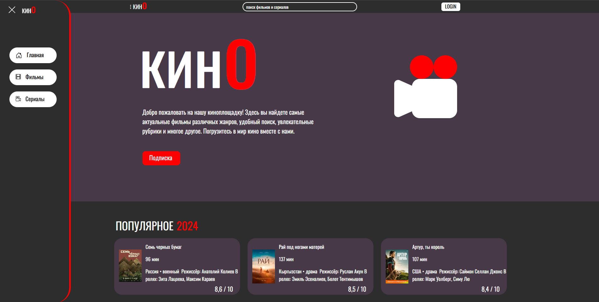

# 🚀 Портфолио [Илья] 

Привет! Я студент [4] курса, увлекаюсь веб-разработкой. Здесь собраны мои учебные и личные проекты (далеко не все, в будущем список увеличу).  

---

## 🔥 Мои проекты

### 1. **FindTrend** | React.js + Auth  

**🔗 Ссылка:** [GitHub](https://github.com/N0RBl/Findtrend)  
**📝 Описание:**  
Интерактивное веб-приложение с системой авторизации. ( 3 курс )  
**🛠 Технологии:**  
- React.js  
- Аутентификация (JWT/OAuth)  
- API интеграция  
**🎯 Особенности:**  
- Реализован вход/выход из аккаунта  
- Полностью сделанный дизайн
---

### 2. **GastroChef** | React.js  

**🔗 Ссылка:** [GitHub](https://github.com/N0RBl/react_project.git)  
**📝 Описание:**  
Сайт по программе питания. ( 3 курс )  
**🛠 Технологии:**  
- React.js  
**🎯 Особенности:**  
- Анимации на CSS
- Была использована библиотека swiper.
- Полностью ручная верстка  
---

### 3. **StarCraft 2** | HTML + CSS  

**🔗 Ссылка:** [GitHub](https://github.com/N0RBl/StarCraft2)  
**📝 Описание:**  
Лендинг по мотивам игры StarCraft 2. ( 2 курс )  
**🛠 Технологии:**  
- Чистый HTML/CSS  
**🎯 Особенности:**  
- Анимации на CSS  
- Полностью ручная верстка  
- Полностью сделанный дизайн
---

### 4. **Film** | HTML + CSS  

**🔗 Ссылка:** [GitHub](https://github.com/N0RBl/website-film-site-)  
**📝 Описание:**  
Учебный проект — сайт о фильмах с кинолентой и описаниями. ( 2 курс )
**🛠 Технологии:**  
- Семантическая верстка  
- CSS-эффекты  
- Полностью сделанный дизайн
---

## 📌 В планах  
- Добавлю больше проектов на React  

---
